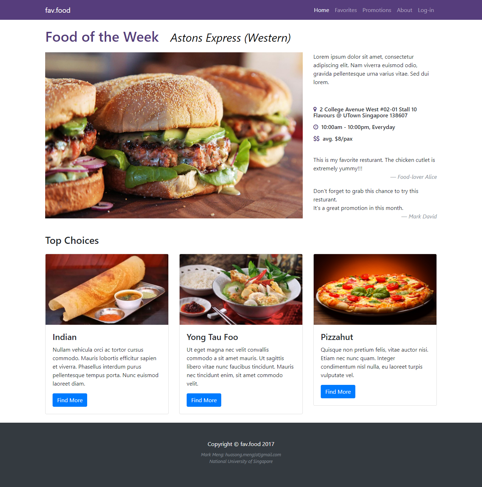

# UI Design and Prototyping Report

*Project Title: fav.food*

*Submission Date: 18 Nov 2017*

## Introduction

This is an idea to develop a web app for the staff & students of my university to browse and vote for the food selling in campus. By introducing this service, all the customer within campus, regardless of students, staff or visitors, can benefit from it to know the best seller and most popular food within campus area. Moreover, users are enabled to share with the latest promotion event on our website so that other users can also know get informed in time.

## User Interface Design and Prototype

The website UI will be designed in a concise and clear style by making use of Bootstrap framework, such as *glyphicons*, *buttons* and *grid* [1].

The index page in browser's display area will be filled the "featured item", which I name it as "Food of the Week". When user scroll down, more food stalls selected from the top of ranking list will shown on the page. 

The screenshot of the prototype of the main page of fav.food project is attached in appendix section at the end of this report.

## Navigation Structure

The structure of the website is planned to be designed in flat manner, thus user may not jump between different webpage for more than 3 times to switch the functionality or browse contents.

The planned navigation structure could be depicted like:

```
+-- index
    +-- promotions
    +-- favorites (login required)
    +-- about
    +-- login
        +-- register
```

## References

[1] Bootstrap, *Bootstrap, a sleek, intuitive, and powerful mobile first front-end framework for faster and easier web development.* [Online] https://getbootstrap.com

## Appendix

The screenshot of index page:

