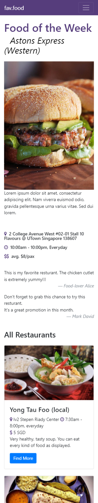

# Application Design and Software Structure Report

*Project Title: fav.food*

*Submission Date: 10 Dec 2017*

## 1. Introduction

This is an idea to develop a web app for the people in university to browse and vote for the food selling in campus. By introducing this service, all the customer within campus, regardless of students, staff or visitors, can benefit from it to know the best seller and most popular food within campus area. By browsing  this web application, users will know the name of the restaurant or food stall, their featured food, the address, opening hours and even their average price. Moreover, users are enabled to share with the latest promotion event on our website so that other users can also know get informed in time.

## 2. Design and Implementation

### 2.1 The REST API Specification

As a web app listing out an exhaustive list of restaurants in a given area, the common operations involved during the implementation could basically summarized as the CRUD (<u>C</u>reate, <u>R</u>ead, <u>U</u>pdate and <u>D</u>elete) actions.

The details REST API provided for CRUD actions are listed below:

#### (1) **Create** (HTTP POST)

We use HTTP Post action to create new data entity into the dataset. 

The code snippet supporting this action in `app.js`:

```javascript
app.post('/restaurantlist', function (req, res) {
	console.log(req.body);
	db.restaurantlist.insert(req.body, function(err, doc) {
		res.json(doc);
	});
});
```

This operation could be simulated in Postman by submitting a POST request with input:

```json
{
  "name": "Pizza Hut",
  "type": "western",
  "addr": "2 College Ave West",
  "description": "A global fastfood brand offering many classic types of Pizza",
  "hour": "10:00am - 9:00pm, everyday",
  "price": "$15"
}
```

#### (2) **Read** (HTTP GET)

We use HTTP Get action to read one or multiple entities from the dataset. There are two routing pattern for this action, one is `restaurantlist/`, which get the list of all existing data, the other one is `restaurantlist/:id` that return the specific data entity by searching its ID.

The code snippet supporting this action in `app.js`:

```javascript
app.get('/restaurantlist', function (req, res) {
	console.log("GET ALL");
	db.restaurantlist.find(function (err, docs) {
		console.log(docs);
		res.json(docs);
	});
});
app.get('/restaurantlist/:id', function (req, res) {
	var id = req.params.id;
	console.log(id);
	db.restaurantlist.findOne({_id: mongojs.ObjectId(id)}, 
                              function (err, docs) {
                                  res.json(docs);
                              });
});
```


#### (3) **Update** (HTTP PUT)

We use HTTP Put action to modify data entity into the dataset. To update details of a restaurant, we need to specify the ID of a restaurant first.

The code snippet supporting this action in `app.js`:

```javascript
app.put('/restaurantlist/:id', function (req, res) {
	var id = req.params.id;
	console.log(req.body.name);
	db.restaurantlist.findAndModify({
      query: {_id: mongojs.ObjectId(id)},
		update: {$set: {
			name: req.body.name,
			type: req.body.type,
			addr: req.body.addr,
			description: req.body.description,
			pic: req.body.pic,
			hour: req.body.hour,
			price: req.body.price,
			featured: req.body.featured
		}}, new: true}, function(err, doc) {
			res.json(doc);
		});
});
```

Similar with HTTP POST request, this operation could be simulated in Postman by submitting a PUT request with input:

```json
{
  "name": "Pizza Hut",
  "type": "fastfood",
  "addr": "2 College Ave West",
  "description": "A global fastfood brand offering many classic types of Pizza",
  "hour": "10:00am - 9:00pm, weekdays only",
  "price": "$15"
}
```

#### (4) **Delete** (HTTP DELETE)

We use HTTP Delete action to remove an entity from the dataset. By specifying the ID of data entity, we could achieve the deletion through submitting a HTTP Delete request to `restaurantlist/:id` .

The code snippet supporting this action in `app.js`:

```javascript
app.delete('/restaurantlist/:id', function (req, res) {
	var id = req.params.id;
	console.log(id);
	db.restaurantlist.remove({_id: mongojs.ObjectId(id)},
                             function(err, doc) {
                                  res.json(doc);
                              });
});
```

### 2.2 Front-end Architecture Design

The front-end of the web-app will be built based on Bootstrap framework. The Bootstrap framework provides an excellent grid mechanism which facilitates the webpage display on different size of screens. 

The main page of fav.food website is a typical usage of Bootstrap framework. Like the fig.1 and fig.2 depicted, the featured restaurant and the list of all other restaurants are two separated rows, and the components within are arranged with different configuration of columns. 

The fig.1 shows the webpage displayed on a normal HD screen which is the most common scenario of PC monitors; the fig.2 show the webpage displayed on a typical mobile device screen. By observing these 2 figures, we can easily find the mechanism of grid framework adopted in our website.

### 2.3 Database Schemas, Design and Structure

MongoDB is chosen as the database solution for this project. The database schemas are similar with the REST API design:

```
database name: restaurantlist
schemas:
 - id: ObjectID
 - name: string
 - type: list[string]
 - addr: string
 - description: string
 - price: string
 - hour: string
 - featured: boolean
 - pic: URL
```

### 2.4 Communication

The AngularJS is selected as the control mechanism of our project MVC architecture. Under the help of AngularJS, we could easily convert the data model into the front-end HTML components. 

The communication control source code is implemented in a JavaScript file named `controller.js`.  Here I provide some code snippets for the data CRUD handling:

```javascript
...
$scope.addRestaurant = function() {
	console.log($scope.restaurant);
	$http.post('/restaurantlist', 
               $scope.restaurant).success(function (res) {
		console.log(res);
		refresh();
	});
};

$scope.removeRestaurant = function(id) {
	console.log(id);
	$http.delete('/restaurantlist/' + id).success(
      function (res) {
		refresh();
	});
};

$scope.update = function() {
	console.log($scope.restaurant._id);
	$http.put('/restaurantlist/' + $scope.restaurant._id, 
              $scope.restaurant).success(
      			function (res) {
					refresh();
				});
};
...
```

The usage of AngularJS in front-end HTML in our project contains `ng-app`, `ng-controller`, `ng-repeat`, `ng-model` and `ng-click`. For example, the code snippet of displaying full list of restaurants in `index.html` is like:

```html
<div class="row">
  <div class="col-md-4 col-sm-6 mb-4" 
       ng-repeat="restaurant in restaurantlist">
    <div class="card">
      
      <div class="card-body">
        <h4 class="card-title">
          {{restaurant.name}} ({{restaurant.type}})
        </h4>
        <p class="card-text">
          <i class="fa fa-map-marker" 
             aria-hidden="true" 
             style="color:#563d7c">
          </i>&nbsp;{{restaurant.addr}}
          <i class="fa fa-clock-o" 
             aria-hidden="true" 
             style="color:#563d7c">
          </i>&nbsp;{{restaurant.hour}}</br>
          <i class="fa fa-usd" 
             aria-hidden="true" 
             style="color:#563d7c">
          </i>&nbsp;{{restaurant.price}}</br>      
          {{restaurant.description}}
        </p>
      </div>
    </div>
  </div>
</div>
```

## 3. Conclusions

This report introduces the application design and software structure of the project named "fav.food". 

The REST API is designed during early stage of the development and later is adopted in MongoDB integration. 

In order to facilitate the website usage on various platform, the Bootstrap framework is used in front-end implementation.

For the connection between front-end HTML and back-end data models, the AngularJS framework is selected to handle data access and modification.

In upcoming weeks, we are going to further the integration of all key component of MEAN full stack development, including replacing static data storage by MongoDB, implementation of user profiling and applying Cordova for better user experience on mobile platform.

## Appendix


Fig1. Index page of fav.food on traditional PC screen



Fig2. Index page of fav.food on mobile platform